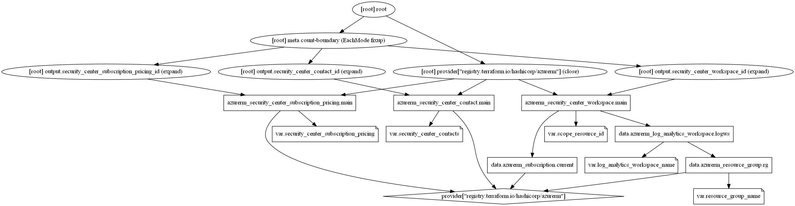

# Security Center Terraform module

Azure Security Center is a unified infrastructure security management system that strengthens the security posture of your data centers and provides advanced threat protection across your hybrid workloads in the cloud. This module helps you to create Azure Security Center resources for Azure Landing Zones.

Security Center collects data from the Azure virtual machines (VMs), virtual machine scale sets, IaaS containers, and non-Azure (including on-premises) computers to monitor for security vulnerabilities and threats. Data is collected using the `Log Analytics agent`, which reads various security-related configurations and event logs from the machine and copies the data to the workspace for analysis.  Data collected by Security Center stored in __Log Analytics workspace(s)__.

## Module Usage

```hcl
module "security-center" {
  source  = "kumarvna/security-center/azurerm"
  version = "1.0.0"

  # Resource Group, location, log analytics details
  resource_group_name          = "rg-shared-westeurope-01"
  log_analytics_workspace_name = "loganalytics-we-sharedtest"

  # Subscription Security Center contacts
  # One or more email addresses seperated by commas not supported by Azure proivider currently
  security_center_contacts = {
    email               = "abc@xyz.com"   # must be a valid email address
    phone               = "+919010910910" # Optional
    alert_notifications = true
    alerts_to_admins    = true
  }
}
```

## Requirements

Name | Version
-----|--------
terraform | >= 0.13
azurerm | ~> 2.27

## Providers

| Name | Version |
|------|---------|
azurerm | 2.27.0

## Inputs

Name | Description | Type | Default
---- | ----------- | ---- | -------
`resource_group_name` | The name of the resource group in which resources are created | string | `""`
`log_analytics_workspace_name`|The name of log analytics workspace name|string|`""`
`security_center_contacts`|Manages the subscription's Security Center Contact|object|{}
`scope_resource_id`|The scope of VMs to send their security data to the desired workspace, unless overridden by a setting with more specific scope|string|`current Subscripion id`

## Outputs

Name | Description
---- | -----------
`security_center_workspace_id`|The Security Center Workspace resource ID
`security_center_subscription_pricing_id`|The subscription pricing resource ID
`security_center_contact_id`|The Security Center Contact resource ID

## Resource Graph



## Authors

Originally created by [Kumaraswamy Vithanala](mailto:kumarvna@gmail.com)

## Other resources

* [Azure Security Center](https://docs.microsoft.com/en-us/azure/security-center/security-center-introduction)
* [Terraform AzureRM Provider Documentation](https://www.terraform.io/docs/providers/azurerm/index.html)
